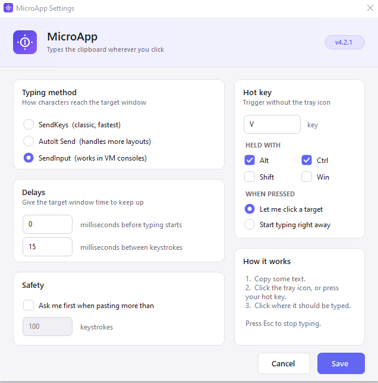
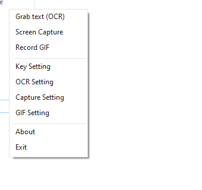
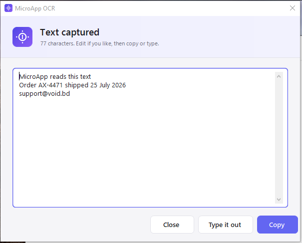
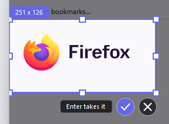
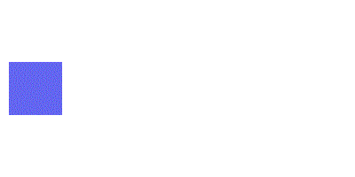
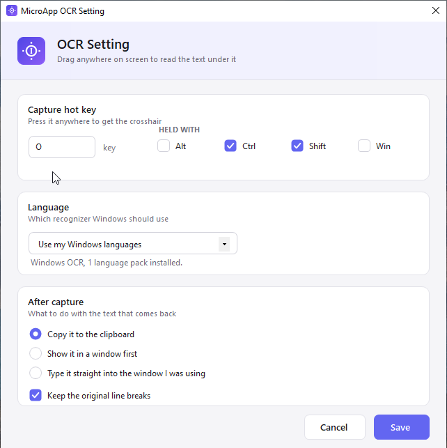
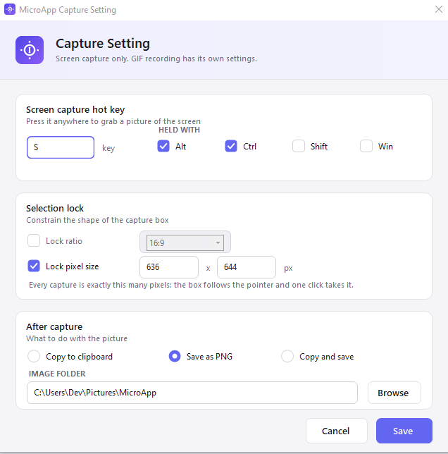
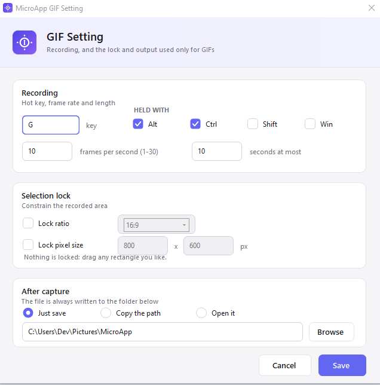
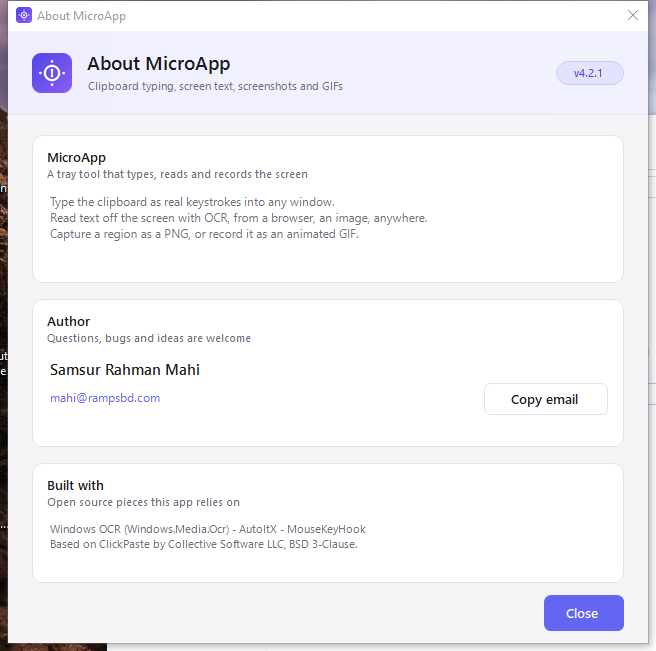

# MicroApp

A small Windows tray tool that does four things well:

- **Types the clipboard as real keystrokes** into any window — including ones that block paste (VM consoles, remote desktops, KVM/IPMI consoles, fields that refuse Ctrl+V).
- **Reads text off the screen with OCR** — drag over a browser, an image, a PDF, a video frame, anything.
- **Captures a screen region as a PNG**, with an optional locked ratio or locked pixel size.
- **Records a screen region as an animated GIF.**

Everything runs offline. No account, no service, no telemetry. Text recognition uses the OCR engine built into Windows 10/11.



---

## Install

**Installer** — download `MicroApp-4.2.1-setup.exe` from the
[latest release](https://github.com/Mahi-BD/MicroApp/releases/latest) and run it. The last page asks
whether MicroApp should **run when Windows starts**; tick it and it will. There is also a
`-peruser-setup.exe` that installs into your profile and needs no administrator rights.

**Portable** — or take `MicroApp-4.2.1-win-x64.zip`, unzip it anywhere and run `MicroApp.exe`. Nothing
is written outside your settings file.

Either way, MicroApp lives in the notification area — there is no main window. Right-click the tray icon
for everything: actions on top, settings below.



Requires **Windows 10 (1809+) or Windows 11** and the **.NET Framework 4.8** runtime, which ships with both.

---

## The four features

### 1. Paste as keystrokes

Copy some text, then either click the tray icon and click your target, or press the hot key
(**Ctrl+Alt+V** by default). The pointer becomes a crosshair; click where the text should land and
MicroApp types it there.

Three typing engines, because no single one works everywhere:

| Method | Use it when |
|---|---|
| `SendKeys` | Normal Windows apps. Fastest. |
| `AutoIt Send` | Odd keyboard layouts, some legacy apps. |
| `SendInput` (default) | VM consoles, remote desktops, anything that ignores the other two. |

Delays, a confirmation threshold for long pastes, and the hot key all live in **Key Setting**.

### 2. Grab text (OCR)

Press **Ctrl+Shift+O** (or tray → *Grab text (OCR)*), drag a box over any text on screen, and MicroApp
reads it.

The result can go straight to the clipboard, into a preview window you can edit first, or be typed
into the window you came from.



Recognition uses `Windows.Media.Ocr`. Whatever OCR language packs Windows has installed appear in the
language list — add more under *Windows Settings → Time & language → Language & region*.

### 3. Screen capture

Press **Ctrl+Alt+S** (or tray → *Screen Capture*) and drag. The screen freezes and dims so the selection
is easy to see, and the dimming never ends up in the picture.



Two optional constraints:

- **Lock ratio** — dragging snaps to 16:9, 4:3, 1:1, 21:9 … (or any `W:H` you type).
- **Lock pixel size** — the box becomes an exact size, follows the pointer, and one click takes the shot.

The image goes to the clipboard, to a PNG, or both.

### 4. Record GIF

Press **Ctrl+Alt+G** (or tray → *Record GIF*), pick a region, and MicroApp records it. A small red badge
shows elapsed time, placed outside the recorded area so it stays out of the frames. Stop with **Esc**,
the hot key again, or by clicking the badge.



Frames stream straight to disk while recording, so a long capture costs no more memory than a short one.
GIF recording has its own hot key, frame rate, length limit, selection lock and output folder — separate
from screen capture.

---

## Settings

Four focused windows, all reachable from the tray menu:

| Window | Covers |
|---|---|
| **Key Setting** | Typing method, delays, confirmation threshold, typing hot key |
| **OCR Setting** | OCR hot key, recognizer language, what happens to the text |
| **Capture Setting** | Screen capture hot key, selection lock, image output + folder |
| **GIF Setting** | GIF hot key, fps and length, selection lock, GIF output + folder |

| | |
|---|---|
|  |  |
|  |  |

The full reference — every default, and the troubleshooting list — is in **[HELP.md](HELP.md)**.

---

## Default hot keys

| Action | Hot key |
|---|---|
| Paste as keystrokes | `Ctrl + Alt + V` |
| Grab text (OCR) | `Ctrl + Shift + O` |
| Screen capture | `Ctrl + Alt + S` |
| Record GIF | `Ctrl + Alt + G` |
| Cancel anything in progress | `Esc` |

Global hot keys win over the focused app, so if one collides with something you use, change it — every
hot key is editable in its settings window, and clearing the key box disables that hot key entirely.

---

## Build

C#, WinForms, .NET Framework 4.8. See **[BUILD.md](BUILD.md)** for the full walkthrough.

```
msbuild MicroApp.sln /p:Configuration=Release /p:SkipCodeSigning=true
```

---

## Author

**Samsur Rahman Mahi** — [mahi@rampsbd.com](mailto:mahi@rampsbd.com)

## License and attribution

BSD 3-Clause. MicroApp began as a fork of
[ClickPaste](https://github.com/Collective-Software/ClickPaste) by Collective Software LLC, whose
copyright and license are kept intact in [LICENSE](LICENSE); [NOTICE.md](NOTICE.md) lists what was
added on top.
