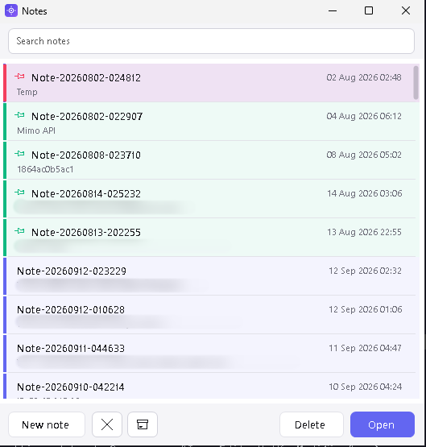
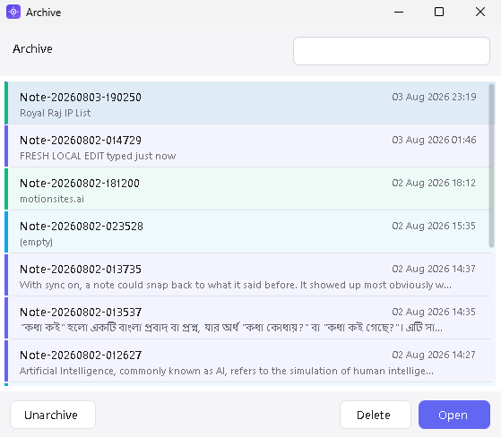
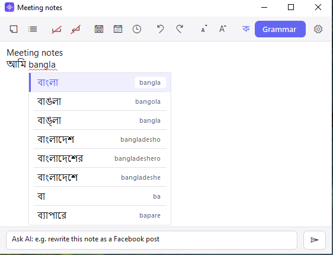
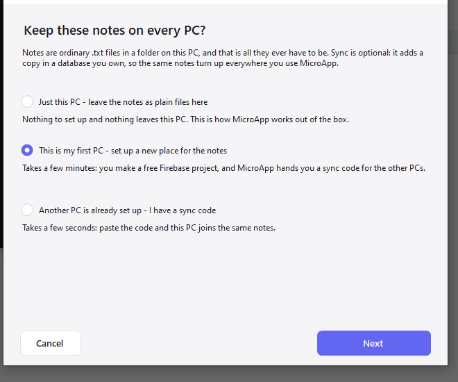

# MicroApp

A small Windows tray tool that does a handful of things well:

- **Types the clipboard as real keystrokes** into any window — including ones that block paste (VM consoles, remote desktops, KVM/IPMI consoles, fields that refuse Ctrl+V). Handles every script, Bangla included.
- **Reads text off the screen with OCR** — drag over a browser, an image, a PDF, a video frame, anything.
- **Picks the exact text of any control** — like a colour picker, but for text (UI Automation, no OCR).
- **Captures a screen region as a PNG**, with an optional locked ratio or locked pixel size.
- **Records a screen region as an animated GIF.**
- **Records a screen region as an MP4 video with sound**, no time limit, with pause/resume.
- **Quick notes** — a hot key opens a fresh scratch-pad note that saves itself as you type, with spell check, **Bangla phonetic typing**, an **archive** for the ones you are done with, and an AI that fixes grammar or rewrites the note on request.
- **Optionally, the same notes on every PC** — mirrored through a free database **you** own, set up by a wizard. Off until you turn it on.

Everything runs offline. No account, no service, no telemetry. Text recognition uses the OCR engine built into Windows 10/11. The parts that can go online all live in Notes and are yours to enable: the AI buttons (Grammar, Ask AI, Bangla→English), which call the provider you configured with your own key when you click them; Bangla phonetic typing, which looks words up in the [string.bd](https://string.bd) dictionary with your own token; and note sync, which talks to a Firebase project created under your own Google account. There is no MicroApp server anywhere in that picture — nothing is hosted by this project, and your notes never pass through anyone else's account.


---

## Install

**Installer** — download `MicroApp-4.5.0-setup.exe` from the
[latest release](https://github.com/Mahi-BD/MicroApp/releases/latest) and run it. The last page asks
whether MicroApp should **run when Windows starts**; tick it and it will. There is also a
`-peruser-setup.exe` that installs into your profile and needs no administrator rights.

**Portable** — or take `MicroApp-4.5.0-win-x64.zip`, unzip it anywhere and run `MicroApp.exe`. Nothing
is written outside your settings file.

Step-by-step instructions, silent-install switches, first-run setup for the AI and Bangla keys,
upgrading and uninstalling are all in **[SETUP.md](SETUP.md)**.

Either way, MicroApp lives in the notification area — there is no main window. Right-click the tray icon
for everything: actions on top, settings below.


Requires **Windows 10 (1809+) or Windows 11** and the **.NET Framework 4.8** runtime, which ships with both.

---

## The features

### 1. Paste as keystrokes

Copy some text, then either click the tray icon and click your target, or press the hot key
(**Ctrl+Alt+V** by default). The pointer becomes a crosshair; click where the text should land and
MicroApp types it there. Unicode scripts — Bangla, Hindi, Arabic, CJK — are typed correctly
regardless of the keyboard layout.

Three typing engines, because no single one works everywhere:

| Method | Use it when |
|---|---|
| `SendKeys` | Normal Windows apps. Fastest. |
| `AutoIt Send` | Odd keyboard layouts, some legacy apps. |
| `SendInput` (default) | VM consoles, remote desktops, anything that ignores the other two. |

Delays, a confirmation threshold for long pastes, and the hot key all live in **Key Setting**.

### 2. Grab text (OCR)

Press **Ctrl+Shift+O** (or tray → *Grab text (OCR)*), drag a box over any text on screen, and MicroApp
reads it.

The result can go straight to the clipboard, into a preview window you can edit first, or be typed
into the window you came from.


Recognition uses `Windows.Media.Ocr`. Whatever OCR language packs Windows has installed appear in the
language list — add more under *Windows Settings → Time & language → Language & region*.

### 3. Pick Text

Press **Ctrl+Alt+T** (or tray → *Pick Text*). A **+** crosshair with a live preview follows the
pointer; one click grabs the exact text of the control under it through UI Automation — no OCR,
character-perfect, however many lines. The click never reaches the app underneath, and password
fields are never read. Use OCR instead for images, videos and remote desktops.

### 4. Screen capture

Press **Ctrl+Alt+S** (or tray → *Screen Capture*) and drag. The screen freezes and dims so the selection
is easy to see, and the dimming never ends up in the picture. Let go and the frame waits: drag it by
the middle to move it, pull a handle to resize it, nudge it with the arrow keys, then press **Enter**
(or the tick) to take the shot. GIF and video recording pick their region the same way.


A **delay** can be set in Capture Setting (0 by default, i.e. straight away). With one, the frame stays
outlined and a badge counts the seconds down without taking the focus, so you can open a menu or a
tooltip first; the shot is then read fresh off the screen.

Two optional constraints:

- **Lock ratio** — dragging snaps to 16:9, 16:10, 8:5, 4:3, 1:1, 21:9 … (or any `W:H` you type).
- **Lock pixel size** — the box becomes an exact size, follows the pointer, and one click takes the shot.

The image goes to the clipboard, to a PNG, or both.

### 5. Record GIF

Press **Ctrl+Alt+G** (or tray → *Record GIF*), pick a region, and MicroApp records it. A small red badge
shows elapsed time, placed outside the recorded area so it stays out of the frames. Stop with **Esc**,
the hot key again, or by clicking the badge.


Frames stream straight to disk while recording, so a long capture costs no more memory than a short one.
GIF recording has its own hot key, frame rate, length limit, selection lock and output folder — separate
from screen capture.

### 6. Record Video

Press **Ctrl+Alt+R** (or tray → *Record Video*), pick a region, and MicroApp records it as a small
**MP4 (H.264 + AAC)** — with **sound** from the system or a microphone if you want it. A red frame marks
the recorded region and a badge shows the time, with **pause/resume** (paused stretches are simply absent
from the file) and a **save** button. There is no time limit: it records until you save, press **Esc**,
or press the hot key again. Encoding uses the codecs built into Windows; the video streams to disk while
it records.

### 7. Notes

Press **Ctrl+Shift+N** (or tray → *New Note*) and a fresh note opens in front of whatever you were
doing — every press gives a new one. A note is one window backed by one plain `.txt` file that
**saves itself as you type**; its title follows its first line. The toolbar strips spaces, joins
lines, inserts the date, long date or a timestamp in formats you choose, undoes and redoes
(**Ctrl+Z** / **Ctrl+Y**), and steps the text size with **A- / A+**. **Spell check** underlines
mistakes as you type (English, plus Bangla when a Bangla dictionary is installed) with right-click
suggestions. A **colour button** on the toolbar sets that note's colour — and whichever you pick last
is the colour new notes on that PC start in — while the last button **keeps the note above other
windows** while you copy out of it. The **All notes** browser
lists every note with a preview and has a **search box** across the top; click to select, click again to open.
Right-click a note to **pin** it to the top, **archive** it out of the way, give it a **colour** or
delete it — and **drag notes into whatever order you like**. Every note carries its own colour down
the left edge of its row. Notes stay off the taskbar by default so they never pile up there.



**Archive what you are done with.** Archived notes leave the list and live in their own window —
the archive button on the notes toolbar. They sit newest first with the date and time on each row,
a search box in the top right filters by name **and** by what is written inside them, double-click
opens one, and **Unarchive** puts it back where it was. Nothing moves on disk: the `.txt` file stays
exactly where it was.



**Type Bangla by sound.** Click **E / ক** on the toolbar or press **Ctrl+Shift+L**, then type the way
the word sounds: `ami` → আমি, `bhalo` → ভালো. Suggestions appear under the word — **↑ ↓** to move,
**Enter**, **Tab** or **Space** to pick, **Esc** to dismiss. `.` becomes দাঁড়ি (।) and digits become
০–৯. English and Bangla sit at the same size in the same note, and you can switch back mid-sentence.



**Let the AI do the boring part.** The **Grammar** button fixes spelling and grammar in place. The
**Ask AI** box under the note takes an instruction — *rewrite this as a Facebook post*, *translate to
English*, *make it formal* — and applies it; **select some text first and only that part changes**.
Right-click any word to translate it: English words offer Bangla from the dictionary, Bangla words
offer English from the AI. Bring your own key: **MiMo, Gemini, ChatGPT or OpenRouter**, set in Note
Setting, and nothing is sent anywhere until you ask for it.

Bangla phonetic typing needs a free [string.bd](https://string.bd) API token, also set in Note Setting.

**Keep the same notes on every PC — if you want to.** Notes are ordinary `.txt` files on one PC by
default, and that mode needs no account, no network and no setup. *Set up sync* in Note Setting opens
a wizard whose first choice is *Just this PC*; the other two mirror your notes to a database instead.

The database is **a Firebase project you create under your own Google account** — free (Spark plan,
no card), and nothing ships inside MicroApp. The wizard walks the first PC through making one: it
copies the security rules to your clipboard and opens the Firebase console for you. **You never
invent an email address or a password** — MicroApp makes its own sign-in inside your project and
hands you a **sync code**. Every PC after that pastes that one code and is done.

Pins, archive flags, colours and the drag order travel with the notes, a note deleted on one PC is
deleted on the others, and the newer copy always wins — judged on the database's clock, so a PC with
the wrong time set cannot overwrite everyone else. It is close to realtime: a change is up about
three seconds later and on the other PCs within about fifteen. *Disconnect* puts everything back to
local-only at any time, leaving every note where it is.



---

## Settings

Six focused windows, all reachable from the tray menu:

| Window | Covers |
|---|---|
| **Key Setting** | Typing method, delays, confirmation threshold, typing hot key |
| **OCR Setting** | OCR + Pick Text hot keys, recognizer language, what happens to the text |
| **Capture Setting** | Screen capture hot key, selection lock, image output + folder |
| **GIF Setting** | GIF hot key, fps and length, selection lock, GIF output + folder |
| **Video Setting** | Video hot key, fps, quality, sound source, selection lock, output folder |
| **Note Setting** | Note hot key, taskbar behaviour, date/time formats, AI provider + key, string.bd token, note sync |

| | |
|---|---|
|  |  |
|  |  |

The full reference — every default, and the troubleshooting list — is in **[HELP.md](HELP.md)**;
installing and first-run setup are in **[SETUP.md](SETUP.md)**.

---

## Default hot keys

| Action | Hot key |
|---|---|
| Paste as keystrokes | `Ctrl + Alt + V` |
| Grab text (OCR) | `Ctrl + Shift + O` |
| Pick Text | `Ctrl + Alt + T` |
| Screen capture | `Ctrl + Alt + S` |
| Record GIF | `Ctrl + Alt + G` |
| Record Video | `Ctrl + Alt + R` |
| New note | `Ctrl + Shift + N` |
| Bangla / English in a note | `Ctrl + Shift + L` |
| Cancel anything in progress | `Esc` |

Hot keys act the moment the combination is pressed — the crosshair appears while the keys are still held.

Global hot keys win over the focused app, so if one collides with something you use, change it — every
hot key is editable in its settings window, and clearing the key box disables that hot key entirely.

---

## Build

C#, WinForms, .NET Framework 4.8. See **[BUILD.md](BUILD.md)** for the full walkthrough.

```
msbuild MicroApp.sln /p:Configuration=Release /p:SkipCodeSigning=true
```

---

## Author

**Samsur Rahman Mahi** — [mahi@rampsbd.com](mailto:mahi@rampsbd.com)

## License and attribution

BSD 3-Clause. MicroApp began as a fork of
[ClickPaste](https://github.com/Collective-Software/ClickPaste) by Collective Software LLC, whose
copyright and license are kept intact in [LICENSE](LICENSE); [NOTICE.md](NOTICE.md) lists what was
added on top.
